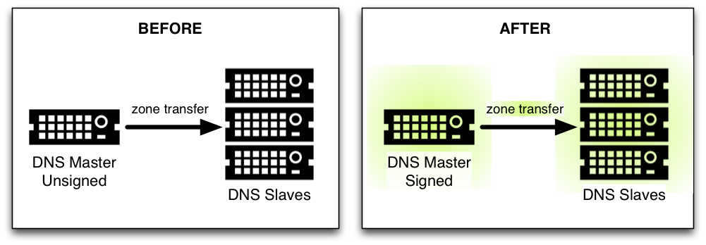
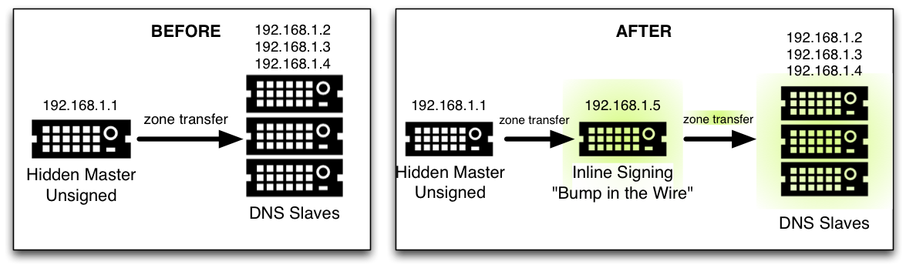

.. _recipes-dnssec-signing:

DNSSEC Signing Recipes
======================

There are two recipes here, the first shows an example of using DNSSEC
signing on the primary server, which is what we have covered in this
guide thus far; the second example shows how to setup a "bump in the
wire" between the hidden primary and the secondary servers to seamlessly
sign the zone on the fly.

.. _recipes-dnssec-signing-primary:

Master Server DNSSEC Signing Recipe
-----------------------------------

In this recipe, our servers are illustrated as shown in
`figure_title <#dnssec-signing-1>`__: we have a primary server
192.168.1.1 and three secondary servers (192.168.1.2, 192.168.1.3, and
192.168.1.4) that receive zone transfers. In order to get the zone
signed, we need to reconfigure the primary server, Once reconfigured, a
signed version of the zone is generated on the fly,
and zone transfers will take care of synchronizing the signed zone data
to all secondary name servers, without configuration or software changes
on them.

   DNSSEC Signing Recipe #1

Using the method described in
`??? <#easy-start-guide-for-authoritative-servers>`__, we just need to
add a ``dnssec-policy`` statement to the relevant zone clause. This is
what the ``named.conf`` looks like on the primary server, 192.168.1.1:

::

   zone "example.com" IN {
       type primary;
       file "db/example.com.db";
       key-directory "keys/example.com";
       dnssec-policy default;
       allow-transfer { 192.168.1.2; 192.168.1.3; 192.168.1.4; };
   };

We have chosen to use the default policy, storing the keys generated for
the zone in the directory ``keys/example.com``. If you wish to use a
custom policy, then you need to define the policy in the configuration
file and select it in the zone statement (as described in
`??? <#signing-custom-policy>`__).

On the secondary servers, ``named.conf`` does not need to be updated,
and it looks like this:

::

   zone "example.com" IN {
       type secondary;
       file "db/example.com.db";
       masters { 192.168.1.1; };
   };

In fact, the secondary servers do not even need to be running BIND, it
could be running any other DNS product that has DNSSEC support.

.. _recipes-dnssec-signing-bump-in-the-wire:

"Bump in the Wire" Signing Recipe
----------------------------------------

In this recipe, we are taking advantage of the power of automated signing
by placing an additional name server 192.168.1.5 between the hidden
primary (192.168.1.1) and the DNS secondaries (192.168.1.2, 192.168.1.3,
and 192.168.1.4). The additional name server 192.168.1.5 acts as a "bump
in the wire", taking unsigned zone from the hidden primary on one end,
and sending out signed data on the other end to the secondary name
servers. The steps described in this recipe may be used as part of the
DNSSEC deployment strategy, since it requires minimal changes made to
the existing hidden DNS primary and DNS secondaries.

   DNSSEC Signing Scenario #2

It is important to remember that 192.168.1.1 in this case is a hidden
primary not exposed to the world, it must not be listed in the NS RRset.
Otherwise the world will get conflicting answers, unsigned answers from
the hidden primary, and signed answers from the other name servers.

The only configuration change needed on the hidden primary 192.168.1.1
is to make sure it allows our middle box to perform a zone transfer:

::

   zone "example.com" IN {
       ...
       allow-transfer { 192.168.1.5; };
       ...
   };

On the middle box 192.168.1.5, all the tasks described in
`??? <#easy-start-guide-for-authoritative-servers>`__ still need to be
performed, such as generating key pairs and uploading information to
parent zone. This server is configured as secondary to the hidden
primary 192.168.1.1, receiving the unsigned data, and then using keys
accessible to this middle box, sign data on the fly, and send out the
signed data via zone transfer to the other three DNS secondaries. Its
``named.conf`` looks like this:

::

   zone example.com {
       type secondary;
       masters { 192.168.1.1; };
       file "db/example.com.db";
       key-directory "keys/example.com";
       dnssec-policy default;
       allow-transfer { 192.168.1.2; 192.168.1.3; 192.168.1.4; };
   };

(As before, the default policy has been selected here. See
`??? <#signing-custom-policy>`__ for instructions as to how to define
and use a custom policy.)

Finally, on the three secondary servers, configuration should be updated
to receive zone transfer from 192.168.1.5 (middle box) instead of
192.168.1.1 (hidden primary). If using BIND, the ``named.conf`` looks
like this:

::

   zone "example.com" IN {
       type secondary;
       file "db/example.com.db";
       masters { 192.168.1.5; };   # this was 192.168.1.1 before!
   };
