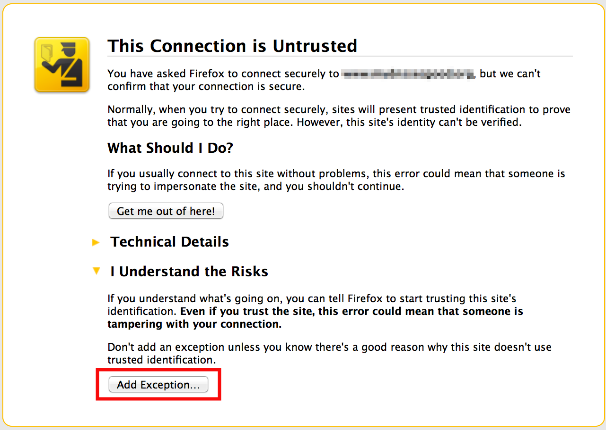
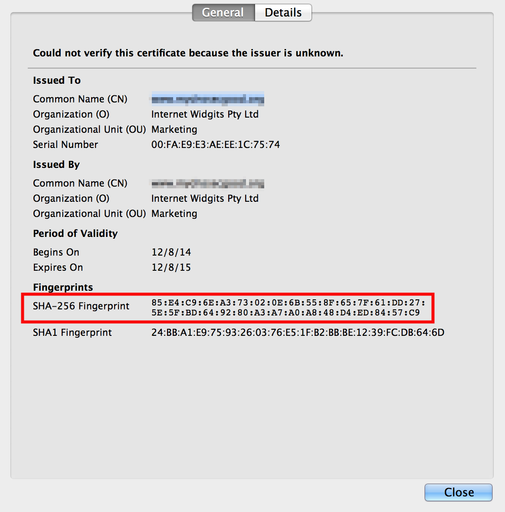

.. _recipes-tlsa:

Self-signed Certificate Recipe
==============================

This recipe describes how to configure DNS(SEC) to include a TLSA record
that acts as a different channel to provide verification for a
self-signed x509 (SSL) certificate.

.. note::

   TLSA is still in an early stage of deployment. One of the road blocks
   that exists as of late 2016 is the lack of built-in application
   support in web browsers and mail applications. As these applications
   add support for TLSA, steps described in this recipe will become more
   relevant and practical. Today (as of late 2016), unfortunately, most
   applications lack native support and will likely result in some kind
   of error message or warning even if you have deployed TLSA correctly.

   The `Wikipedia page for
   DANE <https://en.wikipedia.org/wiki/DNS-based_Authentication_of_Named_Entities#Support>`__
   contains a list of current applications, libraries and plugins that
   provide TLSA support.

For this recipe, we are assuming that you already have a working web
server configured with a self-signed x509 certificate. Although the
steps described below works for self-signed certificates, it can also be
used for "real" certificates that were signed by a Certificate Authority
(usually a service you pay for). This is one of several possible uses of
DNS-Based Authentication of Named Entities, or DANE (we briefly talked
about DANE in `??? <#introduction-to-dane>`__).

First, let's take a look at the certificate used by you web server:

::

   # cat server.crt
   -----BEGIN CERTIFICATE-----
   MIICVTCCAb4CCQChk/gPoAqkWjANBgkqhkiG9w0BAQsFADBvMQswCQYDVQQGEwJV
   UzELMAkGA1UECAwCQ0ExFjAUBgNVBAcMDVNhbiBGcmFuY2lzY28xITAfBgNVBAoM
   GEludGVybmV0IFdpZGdpdHMgUHR5IEx0ZDEYMBYGA1UEAwwPd3d3LmV4YW1wbGUu
   Y29tMB4XDTE0MTIwODA2MDMxNFoXDTI0MTIwNTA2MDMxNFowbzELMAkGA1UEBhMC
   VVMxCzAJBgNVBAgMAkNBMRYwFAYDVQQHDA1TYW4gRnJhbmNpc2NvMSEwHwYDVQQK
   DBhJbnRlcm5ldCBXaWRnaXRzIFB0eSBMdGQxGDAWBgNVBAMMD3d3dy5leGFtcGxl
   LmNvbTCBnzANBgkqhkiG9w0BAQEFAAOBjQAwgYkCgYEAzovVMAexPZHg8MaL2xfE
   IfwPKxCdcCzF2eEvl3euIk2esQ0r3GE+xEVqf/lggCC0OH0q6TXs+6XFYvc4+O/m
   LEh6DFnfn8Kz3T0d6mG2l8YuhhkLLrwugvvaAcHqMoVeZRPqFLhlfaUsoGxb+CPs
   3B8xYFisUqNJp6Tr26MhSVECAwEAATANBgkqhkiG9w0BAQsFAAOBgQC7lQbdSkaM
   x8B6RIs+PMOZ14RlA1UcPNUPPAK0vK23/ie1SfxSHIw6PlOba+ZQZusrDRYooR3B
   viM+cUnhD5UvhU4bn3ZP0cp+WNsimycf/gdfkAe47Em1oVNZP6abUgqMPStongIB
   7uonP6j74A/BTF5kdUsaDPoDfvGnCjZMsQ==
   -----END CERTIFICATE-----

Next, use ``openssl`` to generate a SHA-256 fingerprint of this
certificate, this is what you will list in DNS as a TLSA record. Also,
you need to remove all the colons, hence the added ``tr`` at the end to
filter out all ":" characters:

::

   # openssl x509 -noout -fingerprint -sha256 < server.crt | tr -d :
   SHA256 Fingerprint=294874DA378148CDD1B9C57D2E891E8C294D2958F0BCA7400A0D6D6F50C4A3BB

Now you can insert the TLSA record by editing the zone file the old
fashioned way, or if your DNS server is allowing dynamic updates, you
could use ``nsupdate`` like this to inject the TLSA record:

::

   # nsupdate
   > server localhost
   > update add _443._tcp.www.example.com. 3600 IN TLSA 3 0 1 294874DA378148CDD1B9C57D2E891E8C294D2958F0BCA7400A0D6D6F50C4A3BB
   > send
   > quit

Let's talks briefly about the record you just added. The name is a
specifically formed "_443._tcp.www.example.com", which specifies the
usage of TCP port 443, for the name "www.example.com". It is followed by
three parameters, each representing usage, selector, and matching type.
For this recipe, we will not dissect into all the possible combinations
of these parameters. The examples listed here are 3, 0, and 1, which
represent:

-  Usage: 3 = self-signed certificate

-  Selector 0 = full certificate is included

-  Matching Type 1 = SHA-256

If you are interested in learning (a lot) more about the TLSA record
type, check out `"A Step-by-Step guide for implementing DANE with a
Proof of Concept" by Sandoche Balakrichenan, Stephane Bortzmeyer, and
Mohsen Souissi (April 15,
2013) <https://www.ietf.org/mail-archive/web/dane/current/pdfk2DbQF0Oxs.pdf>`__

Assuming you have successfully added the new TLSA record and generated
the appropriate signature(s), now you can query for it:

::

   $ dig _443._tcp.www.example.com. TLSA

   ...
   ;; ANSWER SECTION:
   _443._tcp.www.example.com.  3600 IN TLSA    3 0 1 294874DA378148CDD1B9C57D2E891E8C294D2958F0BCA7400A0D6D6F 50C4A3BB
   ...

Great! But that's still only half of the equation. We still need to make
your web browser utilize this new information. For this recipe, we are
showing you results of using Firefox with a plugin called DNSSEC TLSA
Validator from ` <https://www.dnssec-validator.cz>`__.

Once the plugin is installed, activated, and Firefox restarted, when you
visit the URL https://www.example.com, your browser will prompt you for
a warning, because this is a self-signed certificate:

   Browser Certificate Warning

Although the certificate is not trusted by the browser itself (if you
want to you'll have to install a custom CA root or make the browser
trust the certificate individually), the plugin shows that it was able
to verify the information it received via HTTPS (port 443), and that it
matches the information it received via TLSA lookup over DNS (port 53).

   DNSSEC TLSA Validator
