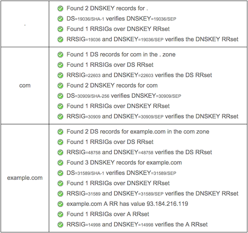
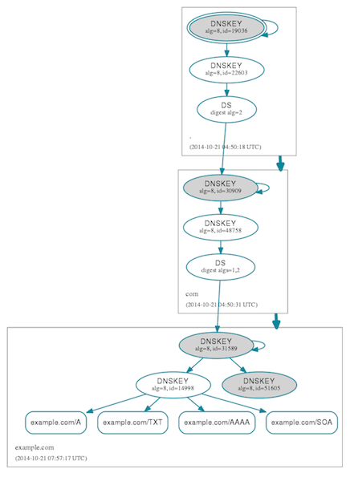

.. _signing-verify-using-external-tools:

External Testing Tools
======================

The easiest ways to see if your domain name is fully secured is to use
one of these excellent online tools.

1. Verisign Labs DNSSEC Debugger

2. DNSViz

.. _external-tools-dnssec-debugger:

Verisign DNSSEC Debugger
------------------------

URL: ` <https://dnssec-debugger.verisignlabs.com/>`__

This tool shows a nice summary of checks performed on your domain name,
and you can expand to view more details for each of the items checked to
get a detailed report.

   Verisign DNSSEC Debugger

.. _external-tools-dnsviz:

DNSViz
------

URL: ` <https://dnsviz.net/>`__

DNSViz provides a visual analysis of the DNSSEC authentication chain for
a domain name and its resolution path in the DNS namespace.

   DNSViz
